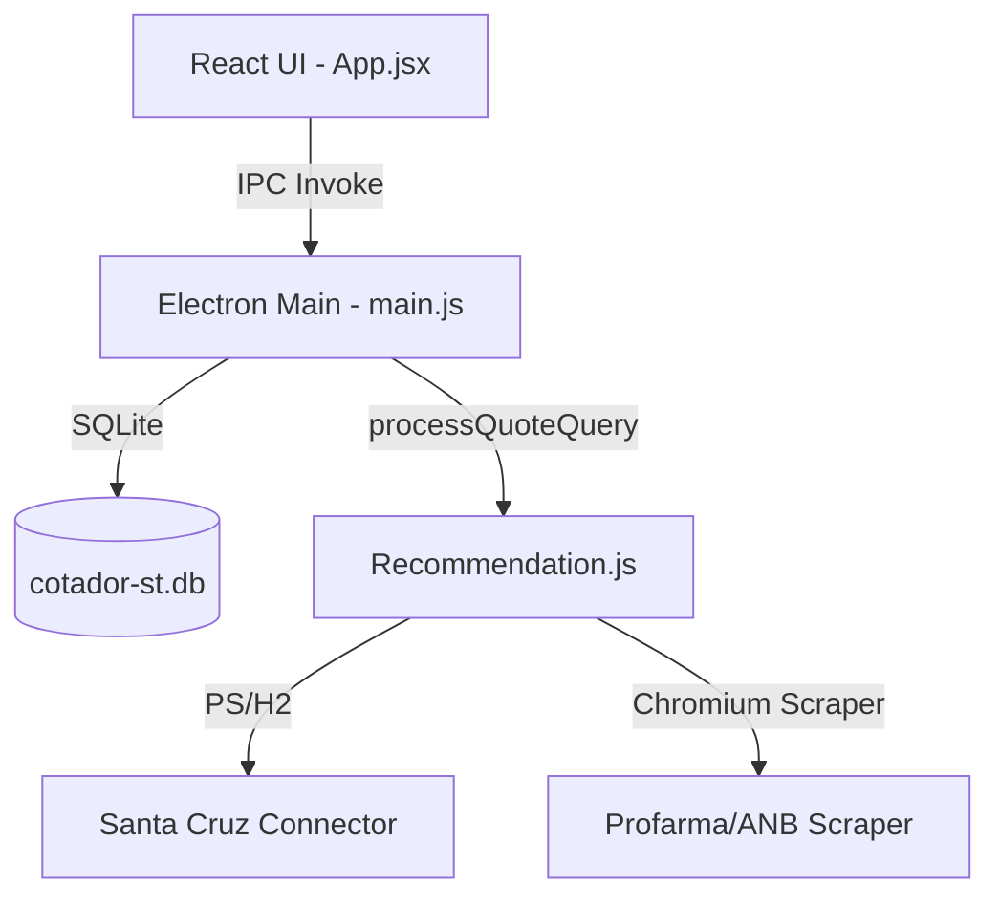

# 📖 Documentação Técnica Master - Wimifarma Cotação

Este documento destina-se a orientar outras inteligências artificiais e desenvolvedores sobre a arquitetura, regras de negócio e fluxo técnico do projeto de cotação de farmácia.

---

## 🏗️ 1. Arquitetura do Sistema

O sistema é um aplicativo desktop construído sobre **Electron** e **Vite + React (Frontend)**, comunicando-se via canais de IPC (Inter-Process Communication).



### Principais Arquivos e Funções:
*   [main.js](file:///c:/Users/Williany/Desktop/cota%C3%A7%C3%A3o/main.js): Ponto de entrada do Electron. Inicializa o banco de dados local SQLite, configura os manipuladores IPC (`run-quote`, `get-history`, `export-excel`, etc.) e gerencia a inicialização das janelas.
*   [src/App.jsx](file:///c:/Users/Williany/Desktop/cota%C3%A7%C3%A3o/src/App.jsx): Interface do usuário (painel). Exibe cotações históricas, inputs de texto lote e tabelas comparativas com foco no preço final de caixa.
*   [src/lib/database.js](file:///c:/Users/Williany/Desktop/cota%C3%A7%C3%A3o/src/lib/database.js): Gerenciamento do banco de dados SQLite local (`cotador-st.db`) contendo tabelas de cotações, buscas salvas e credenciais de distribuidoras.

---

## 🔒 2. Cofre Seguro de Credenciais (Security)

Para proteger as credenciais de acesso das distribuidoras no banco SQLite local, o sistema utiliza o mecanismo de criptografia nativo **Windows DPAPI** fornecido pelo Electron.
*   **Implementação:** No arquivo [database.js](file:///c:/Users/Williany/Desktop/cota%C3%A7%C3%A3o/src/lib/database.js), a função `getSafeStorage()` carrega dinamicamente a API `safeStorage` do Electron.
*   **Gravação:** O campo `password` é criptografado em bytes e salvo no SQLite como string Base64.
*   **Leitura:** O sistema descriptografa o Base64 em texto plano em tempo de execução antes de enviar aos robôs. Se executado fora do Electron (ex: suíte de testes do terminal), o sistema faz bypass automático usando codificação UTF-8 simples.

---

## 🧠 3. Parser e Inteligência de Interpretação

O arquivo [parser.js](file:///c:/Users/Williany/Desktop/cota%C3%A7%C3%A3o/src/lib/parser.js) converte strings livres de busca (ex: `"losartana 50mg 30 comp"`) em objetos de consulta estruturados:

1.  **Validação EAN-13:** Se a busca contiver um número de 13 dígitos, ele passa pela verificação do dígito verificador matemático do padrão EAN-13. Se for falso (como um CNPJ), a string é tratada como termo nominal de busca.
2.  **Dosagem de Medicamento:**
    *   Filtra miligramagens com unidades explícitas (ex: `50mg`, `10ml`, `100ui`).
    *   Contém uma regra de exclusão por *lookahead negativo* (`(?!\s*(?:capsulas|comp...))`) para evitar que quantidades de caixas (ex: `30` em `"losartana 30 cp"`) sejam incorretamente interpretadas como dosagem (`30mg`).
3.  **Apresentações Equivalentes:** Mapeia tokens de apresentações líquidas e sólidas para o seu sinônimo unificado.

---

## 🤖 4. Conectores e Robôs de Distribuidoras

As pesquisas ocorrem em paralelo através dos conectores registrados em `src/connectors/`:

### A. Santa Cruz (PowerShell + Consulta ao Vivo)
*   **Mapeamento:** O script [santacruz-real.js](file:///c:/Users/Williany/Desktop/cota%C3%A7%C3%A3o/src/connectors/real/santacruz-real.js) primeiro tenta usar automação de interface via PowerShell ([santacruz-search.ps1](file:///c:/Users/Williany/Desktop/cota%C3%A7%C3%A3o/src/lib/santacruz-search.ps1)).
*   **Descoberta Portátil:** O robô procura configuração opcional, caminho validado da máquina, processos, atalhos, registro do Windows, pastas padrão e discos fixos. O caminho lembrado contém somente a localização do programa, nunca preços.
*   **PowerShell / UI Automation:** O script abre o programa, trata login/atualização, identifica o campo de pesquisa, digita o medicamento, confirma a busca, aguarda a grade mudar e extrai a cotação exibida naquele momento.
*   **Sem H2:** O banco local `dados.mv.db` não é consultado pelo cotador. Se a interface ao vivo não puder ser pesquisada, a Santa Cruz fica bloqueada como não consultada.

### B. Profarma & ANB Farma (Navegador Chromium Headed/Headless)
*   **Navegador Invisível:** Executado em `src/lib/electron-scraper.js` dentro do contexto do Electron.
*   **Autologin & Captcha:** Identifica formulários de login e insere credenciais. Se o Google reCAPTCHA disparar desafios de imagens, a janela é exibida ao usuário de forma assistida para resolução rápida no clique.
*   **Paginação Contínua:** Varre os botões de paginação do Angular Material (`mat-paginator`) e avança as páginas recursivamente (até o limite de 10) para puxar todos os registros de menor preço.
*   **Evitando Loops de Clique:** Cliques para abrir o dropdown de promoções são limitados a no máximo uma vez a cada 4 segundos (`lastPromoClickTime`), evitando que o scraper fique preso abrindo e fechando combos em loop.

---

## 📊 5. Motor de Decisão e Regras de ST (Substituição Tributária)

O arquivo [st-rules.js](file:///c:/Users/Williany/Desktop/cota%C3%A7%C3%A3o/src/lib/st-rules.js) é responsável por categorizar e priorizar os impostos fiscais:
*   **COM_ST / ST_INCLUSO:** Custo final total já calculado. Altíssima prioridade comercial.
*   **ST_SEPARADO:** O valor do imposto deve ser recolhido por fora.
*   **SEM_ST:** Medicamentos isentos ou sem regra de substituição tributária na compra.

No arquivo [recommendation.js](file:///c:/Users/Williany/Desktop/cota%C3%A7%C3%A3o/src/lib/recommendation.js), o ranqueamento prioriza regras de ST mais seguras e ordena pelo menor custo final.

### Validação de Segurança Contra Perdas Financeiras:
Para evitar erros em que o sistema compare dosagens diferentes por semelhança de texto (ex: `5mg` batendo com `50mg`), implementamos uma validação numérica de dosagem:
```javascript
const queryDosageNum = getDosageNumber(parsed.dosage);
const resDosageNum = getDosageNumber(resDosage);
// Exige igualdade numérica estrita (ex: 50.0 === 5.0 => false)
```
Se a miligramagem numérica for diferente, o produto é ignorado como opção de melhor preço.

---

## 🧹 6. Rotinas de Limpeza e Ciclo de Vida do Terminal

*   **Autolimpeza de Diagnóstico:** Ao iniciar, o `main.js` busca na pasta temporária `scratch/` arquivos `.png`, `.html` e `.log` gerados para depuração que tenham mais de 24 horas de criação e os remove do disco automaticamente.
*   **Fechamento Silencioso do CMD:** No [package.json](file:///c:/Users/Williany/Desktop/cota%C3%A7%C3%A3o/package.json), a instrução `"dev"` roda `concurrently -k`. A flag `-k` (`kill-others`) garante que quando o processo do Electron for fechado pelo usuário (X), o servidor do Vite seja morto em segundo plano e a janela preta do prompt de comando do Windows (CMD) feche instantaneamente sozinha.
