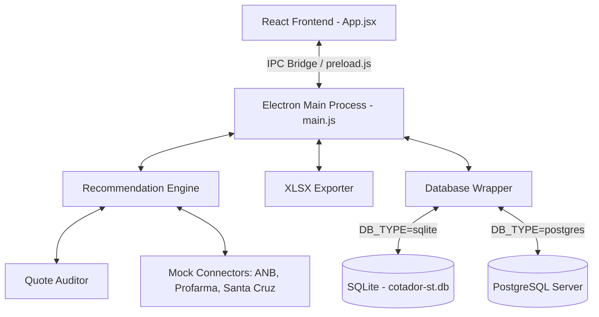
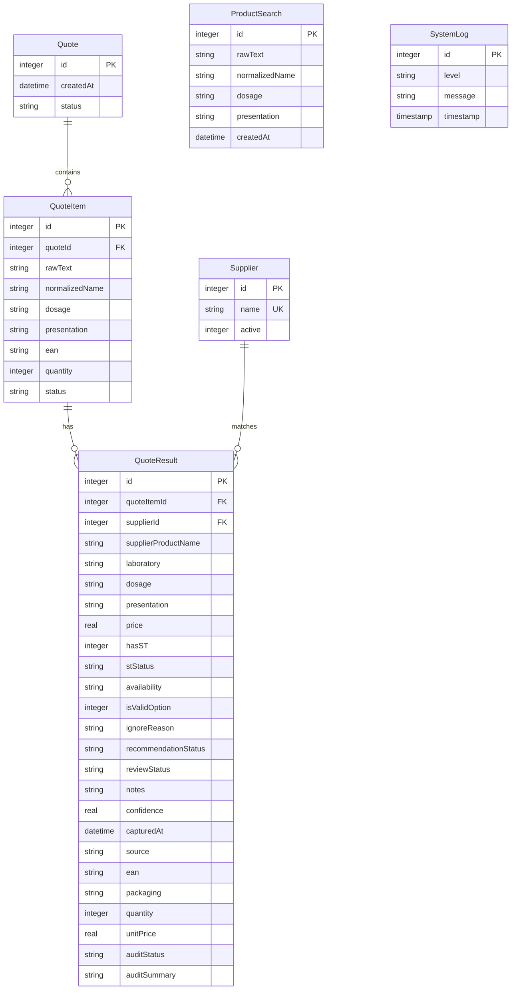

# Master System Guide - AI-Readable Documentation

This guide provides a comprehensive technical overview of the **Cotador Inteligente ST** system, detailing its architecture, database layers, algorithms, and frontend components. It is structured to help any AI agent quickly grasp the codebase, extend functionality, or deploy it onto different environments.

---

## 🏗️ System Architecture & Stack

The application is structured as a Desktop application powered by **Electron** on the backend and **React** (built with **Vite**) on the frontend. It is designed to work in two modes:
1.  **Local Desktop Mode:** Standalone deployment running offline, using local **SQLite** database storage.
2.  **Server Mode:** Web or networked server deployment using a remote **PostgreSQL** database.



---

## 🗄️ Database Layer (Dual-Driver Abstraction)

The system features a custom database adapter in [database.js](file:///c:/Users/Williany/Desktop/cotação/src/lib/database.js) which dynamically detects the `DB_TYPE` environment variable (`sqlite` or `postgres`).

### 1. Unified Interface Wrapper
All query execution calls utilize a unified wrapper (`dbWrapper`), enabling identical SQL execution syntax across the codebase:
- `db.exec(sql)` - For schema initialization.
- `db.run(sql, ...params)` - For inserts/updates. Returns `{ lastID }`.
- `db.get(sql, ...params)` - Fetches a single row.
- `db.all(sql, ...params)` - Fetches an array of rows.

### 2. Query Translator
When `DB_TYPE=postgres`, the database adapter automatically applies string translations to standard SQL queries:
- **Parameter Placeholders:** Translates positional `?` placeholders into indexed `$1, $2, $3` variables.
- **Ignore Conflict:** Converts SQLite-specific `INSERT OR IGNORE INTO` syntax into standard `INSERT INTO ... ON CONFLICT (name) DO NOTHING`.
- **Primary Keys:** Adapts auto-increment declarations (`INTEGER PRIMARY KEY AUTOINCREMENT` $\rightarrow$ `SERIAL PRIMARY KEY`).
- **Insert Returning:** Automatically appends `RETURNING id` to insert queries under PostgreSQL to capture `lastID` correctly.

### 3. Database Schema



---

## ⚙️ Core Engines & Algorithms

### 1. Normalization Parser (`parser.js`)
Extracts structured terms from unstructured text lines using regular expressions and dictionary matching:
- **EAN-13 Check Digit Verification:** Extracts 13-digit sequence candidates `/\b(\d{13})\b/` and validates them using EAN-13 check digit formula (summing odd positions and even positions $\times 3$, mod 10 subtraction). This prevents invalid numbers (like CNPJs or phone numbers) from triggering barcode lookups.
- **Dosage Extraction & Negative Lookahead:** Extracts dosage units (mg, mcg, g, ml, ui) with optional spaces. Standardizes standalone dosage numbers (e.g. "50" -> "50mg"), but utilizes a negative lookahead `(?!\s*(?:capsulas|comp...))` to ignore pack counts (e.g. "30" in "losartana 30 cp") preventing them from polluting dosage attributes.
- **Presentation Matching:** Converts abbreviations (`comp`, `cp`, `caps`, `gts`) to standard forms (`comprimido`, `capsula`, `gotas`) using the `SYNONYMS` table.
- **Quantity Capture:** Extracts package size/count (e.g., "30 comp" $\rightarrow$ quantity `30`).
- **Confidence Rating:** Emits `ALTA` status if both dosage and presentation are verified; otherwise emits `PRODUTO_PARECIDO_REVISAR`.

#### Pharmaceutical Context (`pharmaceutical-context.js`)
- Expands controlled aliases and unique active-ingredient prefixes with a minimum of six characters before a live supplier search. Explicit established aliases such as `hctz` are supported separately.
- Canonicalizes `soro fisiologico` and `solucao fisiologica` as `cloreto de sodio`.
- Extracts known active ingredients and compares combinations as order-independent sets, so `hidrocloro olmesartana` matches `olmesartana + hidroclorotiazida` without relying on the plus sign.
- Keeps the single-ingredient safety gate: a supplier combination is blocked unless the query requests the complete association.
- Treats `xarope` and `suspensao oral` as equivalent while excluding ophthalmic, injectable, nasal, otologic, and other non-oral solutions.
- The same helpers are used by the parser, recommendation pre-check, and final quote auditor to prevent contradictory decisions.

### 2. Substituição Tributária (ST) Rules Engine (`st-rules.js`)
Classifies tax conditions into four operational categories:

| Status | Tax Rule | Recommendation Behavior |
| :--- | :--- | :--- |
| **`COM_ST` / `ST_INCLUSO`** | ST included in invoice cost | **Approved (Priority 1):** Eligible for auto-recommendation |
| **`ST_SEPARADO`** | ST collected on a separate ticket | **Approved (Priority 2):** Flags warning for final cost validation |
| **`SEM_ST`** | No tax replacement | **Ignored:** Filtered out and hidden by default |
| **`ST_DESCONHECIDO`** | Unrecognized tax code | **Flagged:** Excludes recommendation, requires manual revision |

### 3. Recommendation & Ranking Engine (`recommendation.js`)
Ranks matching supplier results:
1. Filter out unavailable options (`availability !== 'disponível'`) and rejected reviews.
2. Reject `SEM_ST` before ranking. A product without ST must never be marked as `isValidOption` and must never receive `Melhor preço com ST`.
3. **Exact Numerical Dosage Check:** Extracts the raw numeric value of dosages (e.g. `"50mg"` $\rightarrow$ `50.0`, `"5mg"` $\rightarrow$ `5.0`) and requires exact mathematical equality (`queryDosage === resultDosage`). This avoids false positive substring matches (like matching "50mg" with "5mg" or "25mg" with "250mg") to prevent costly purchase mistakes. If the search contains name and dosage but omits presentation, matching supplier rows can still be recommended; the audit layer handles missing evidence as warnings instead of forcing every row into "produto parecido".
4. Run the Quote Auditor before ranking. Blocked rows are marked as `auditStatus='BLOQUEADO'`, removed from automatic recommendation, and sent to manual review. Warning rows keep `auditStatus='ATENCAO'` and remain visible with an explanation in `auditSummary`.
5. Group options that pass the valid ST test (`COM_ST`, `ST_INCLUSO`, `ST_SEPARADO`, or the explicit exemption `ST_ISENTO`) and pass the audit gate.
6. Sort by:
   - **Priority 1:** ST Priority (prefer `COM_ST` over `ST_SEPARADO`).
   - **Priority 2:** Lowest `unitPrice` when packaging differs.
7. Annotate the cheapest result as `Melhor preço com ST` and the runner-up as `Segunda opção com ST`.

### 4. Quote Auditor (`quote-auditor.js`)
Validates whether each supplier result is safe to use in the quotation:
- Blocks invalid or zero prices, unavailable products, `SEM_ST`, `ST_DESCONHECIDO`, EAN mismatch on barcode searches, dosage mismatch, presentation mismatch, and product names that do not fuzzy-match the search.
- Warns when non-critical evidence is missing, such as source/EAN, or when package quantity differs from the searched quantity.
- Detects price outliers across suppliers using comparable unit price (`unitPrice` when present, otherwise `price / quantity`) so different pack sizes do not create false alarms.
- Persists the outcome in `QuoteResult.auditStatus` and `QuoteResult.auditSummary`; the UI and XLSX export show these fields and route non-OK rows to review.

### 5. Real Supplier Extraction Rules
- **ANB:** searches with EAN when available; otherwise sends name + dosage + presentation. The captured quote price must come directly from the `Unit c/St.` grid column. Do not rank ANB rows from `Preço`, `Preço + St.`, or package-multiplied values.
- **Profarma:** uses the same Electron BrowserWindow scraper path as ANB and normalizes old portal addresses to `https://pedido.profarma.com.br/`. Login rejection, page failure, and timeout return a blocked supplier-unavailable row instead of an empty/zero-price quote.
- **Santa Cruz:** uses `src/lib/santacruz-search.ps1` for the local JavaFX program. Discovery checks an optional environment override, a validated machine-local path cache, running processes, Desktop/Start Menu shortcuts, uninstall registry entries, standard install folders, and finally a time-bounded fixed-drive scan. It opens the app, handles login, waits for updates, writes the medicine in the live search control, submits the query, waits for the grid to change, and extracts only the visible live result grid.
- **DM Paraná:** opens only `https://portal.dmparana.com.br/login`, searches by medication name, scans all result pages, ignores cards without active purchase stock, and accepts only the literal card field `Preço final: R$`. The bold `R$ .../cada` amount is the raw price and must never be ranked. Each row carries `priceSourceLabel='Preço final: R$'` so the origin remains visible.
- **No stored-price fallback:** `santacruz-h2-reader.js` was removed. The recommendation engine also no longer caches unavailable searches. Historical SQLite rows are output/history only and are never inputs to `processQuoteQuery()`.
- **Freshness gate:** in real mode, every supplier row must have a valid `capturedAt` no older than five minutes. Missing or stale timestamps are blocked before ranking.
- **Fail-closed mode selection:** real operation requires `ENABLE_REAL_CONNECTORS=true`; test mocks require the separate explicit `ENABLE_MOCK_CONNECTORS=true`. When neither is enabled, quotation execution stops instead of silently selecting mocks. Browser UI mocks also require `VITE_ENABLE_UI_MOCKS=true`.

Operational notes added after the 2026-07-17 live tests:
- **ANB promotion gate:** if `#Promo` exists, select the first available promotion/condition before typing the product. The search input being visible is not enough evidence that the product grid is unlocked.
- **ANB popups:** close visible dialogs/overlays before search or extraction, because promotional banners can block the result grid and cause false timeouts.
- **Profarma active route:** use `https://pedido.profarma.com.br/` for ProfarmaOn. Old `portal.profarma.com.br` URLs should be normalized there. If login is rejected or the page stays on login, treat Profarma as unavailable instead of returning zero-price products.
- **Santa Cruz update state:** `SANTACRUZ_STARTUP_WAIT_SECONDS` controls normal startup, while `SANTACRUZ_UPDATE_WAIT_SECONDS` extends the first-run wait when the JavaFX updater is visible. If it still does not expose the live search field, return a blocked unavailable result; never read local product data.
- **Santa Cruz headless process:** if a matching `javaw`/launcher is already running but no UI Automation window exists, do not start a duplicate instance. `SANTACRUZ_HEADLESS_GRACE_SECONDS` allows normal startup briefly; after that, return `running-without-window` as a blocked supplier state.
- **Scraper timeout:** `SCRAPER_TIMEOUT_MS` controls the BrowserWindow scraper timeout for live diagnostics and long supplier pages.
- **Live diagnostic shutdown:** `scratch/codex-live-quote-losartana.mjs` prints the payload before requesting Electron shutdown; it must not call `process.exit()` while native SQLite handles are active.
- **DM search contract:** use only the normalized medication name in the portal input. Dosage, presentation, package quantity, EAN, ST and combination checks remain in the auditor; sending the full parsed phrase can produce a false empty search on this portal.
- **DM pagination and stock:** traverse `Go to next page` while enabled, deduplicate by EAN, require an enabled `Comprar` button, and stop after ten pages as a defensive limit.
- **DM final-price proof:** results without the exact `Preço final: R$` label are discarded instead of falling back to the bold raw amount.

### 6. Credentials Security Vault (`database.js`)
- Enters supplier credentials using Electron's native `safeStorage` API.
- Criptographs passwords at operating system level using **Windows DPAPI** before saving them as Base64 strings in SQLite.
- Seamlessly falls back to transparent UTF-8 conversion in testing/terminal contexts where Electron bindings are unavailable.
- Supports prefixed credential formats (`dpapi:` and `plain:`) so Electron can read credentials created in local terminal diagnostics and legacy Base64 rows.
- Real connectors read credentials from `SupplierCredentials`: ANB (`supplierId=1`), Profarma (`supplierId=2`), Santa Cruz (`supplierId=3`), and DM Paraná (`supplierId=4`). Quote persistence resolves the supplier ID by name instead of assuming the insertion order.
- On a new Windows computer, re-enter credentials in the settings screen. DPAPI-protected password blobs are machine-bound and must not be copied through Git.

---

## 🎨 UI Architecture & Frontend Flow

The React frontend utilizes a modern dark interface with glassmorphic cards and dynamic transitions:
- **`currentView` State Switcher:** Routes between three core views:
  1. `'search'`: Textarea box to enter raw product queries.
  2. `'results'`: Visual dashboard showing structured comparison tables and metrics.
  3. `'logs'`: Diagnositc table displaying the database logs.
- **"Melhor Condição Geral" Card:** Loops through all results to locate the absolute cost-efficient winner:
  - Selects the option with the lowest `unitPrice` across all queries.
  - Highlights EAN, packaging unit, total cost, cost per unit, and estimated savings.
- **Manual Review Interactivity:** Clicking **✏️ Revisar** opens a modal to edit EAN, pricing, ST classification, availability, and notes. Saving triggers a call to `recalculateQuoteItemRecommendations` to re-run the ranking system.

---

## 🛡️ Logging, Audit & Self-Diagnostics

### 1. Dual Logger System
The `logger.js` component operates on a dual-logging system:
- **Database Table:** Inserts logs into `SystemLog` table for live visualization in the web panel.
- **Local File:** Appends logs to `logs/app.log`.

### 2. Log Rotation
To protect server space, the physical `logs/app.log` file is protected by a **2MB limit**. When the file surpasses 2MB, the system automatically truncates it, preserving only the last 500 lines.

---

## 🚀 Environment Setup & Deployment

Configure your project using variables in your `.env` file:

```bash
# Environment Mode
APP_ENV=development
LOG_LEVEL=info

# Scrapers Toggles
ENABLE_MOCK_CONNECTORS=true
ENABLE_REAL_CONNECTORS=false
SHOW_SCRAPER_WINDOW=true
SCRAPER_TIMEOUT_MS=300000
SANTACRUZ_STARTUP_WAIT_SECONDS=180

# Database Switch (sqlite or postgres)
DB_TYPE=sqlite
DATABASE_PATH=local

# If postgres is chosen, specify credentials:
PG_HOST=localhost
PG_PORT=5432
PG_USER=postgres
PG_PASSWORD=yourpassword
PG_DATABASE=cotador_st
```

`ENABLE_REAL_CONNECTORS=false` is a deterministic mock mode and must be treated as business-rule testing only. It returns catalog fixtures instantly and does not represent live supplier pricing. For pharmacy price quotation, use `ENABLE_REAL_CONNECTORS=true` with saved supplier credentials. When `DATABASE_PATH=local`, SQLite is opened from `data/cotador-st.db`; this is the portable database used for local credentials and quote history.

### Running Commands
- **Prepare and Start:** `npm run dev` (Git seguro, dependências e aplicativo)
- **Preparation Only:** `node scripts/bootstrap.mjs --prepare-only`
- **Startup Diagnostics:** `node scripts/bootstrap.mjs --diagnose`
- **Unit Testing:** `npm run test`
- **Windows Packaging:** `npm run build` followed by `npm run package`

### Startup Bootstrap and Updates
- `cotacao.bat`, `cotação.bat`, `start-app.bat` e `wimi cotacao.bat` convergem para o mesmo bootstrap Node, evitando rotas de inicialização com comportamentos diferentes.
- Antes do Electron, o bootstrap consulta o estado Git. Uma atualização só é aceita com worktree limpa, upstream conhecido ou branch idêntica ao padrão de `origin`, `git fetch` bem-sucedido e `git merge --ff-only`.
- Alterações locais em arquivos rastreados, ausência de referência remota segura, falta de Git ou indisponibilidade de rede não apagam arquivos nem bloqueiam a versão instalada; nesses casos a atualização de código é ignorada. Arquivos locais não rastreados são preservados e qualquer conflito faz o `merge --ff-only` abortar.
- `npm install --no-audit --no-fund` reconcilia as dependências declaradas antes de iniciar `dev:app`.
- A interface apenas avisa sobre commits detectados durante a execução. A instalação acontece na próxima abertura, fora do processo Electron, evitando um `git pull` concorrente com arquivos em uso.
- `AUTO_UPDATE_ON_STARTUP=false` desativa a etapa Git. `AUTO_UPDATE_BRANCH` é opcional e só pode completar o upstream da mesma branch que já está ativa; o bootstrap nunca troca de branch automaticamente.

### Test Coverage Focus
The Node test suite validates the high-risk pharmacy purchase paths:
- Parser extraction for EAN, dosage, quantity, presentation, fuzzy names, and vague-query refinement.
- Pharmaceutical context for safe abbreviations, order-independent associations, oral-liquid equivalence, physiological-solution aliases, and unsafe-short-prefix rejection.
- ST safety rules, including the guarantee that `SEM_ST` cannot become a best recommendation.
- Numerical dosage mismatch protection to avoid purchasing the wrong strength.
- Structured unavailable rows when suppliers return no matches.
- SQLite quote persistence plus manual review recalculation.
- XLSX export workbook structure and best/ignored sheet routing.
- Startup update safety for disabled updates, dirty worktrees, missing upstreams, and clean tracked repositories.
- Current validation: `npm test` 57/57, `npm run build` approved, and `npm run lint` without blocking errors.

### Delivery Workflow
- Every completed project change includes synchronized documentation, executable validation, a scoped Git commit, and a push of the current branch by default.
- The staged diff must be reviewed before commit. Credentials, `.env`, databases, logs, caches, screenshots, and supplier-owned binaries stay local.
- A blocked push does not justify rewriting history or discarding work. Keep the local commit and report the exact authentication, network, or remote rejection.
