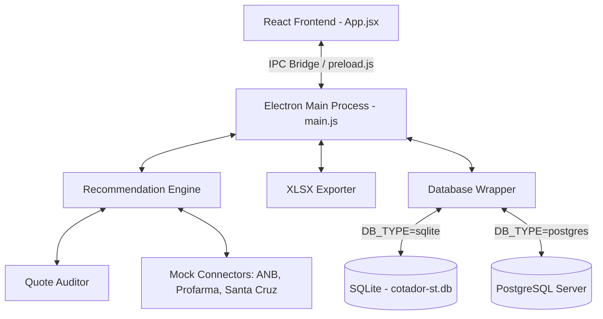
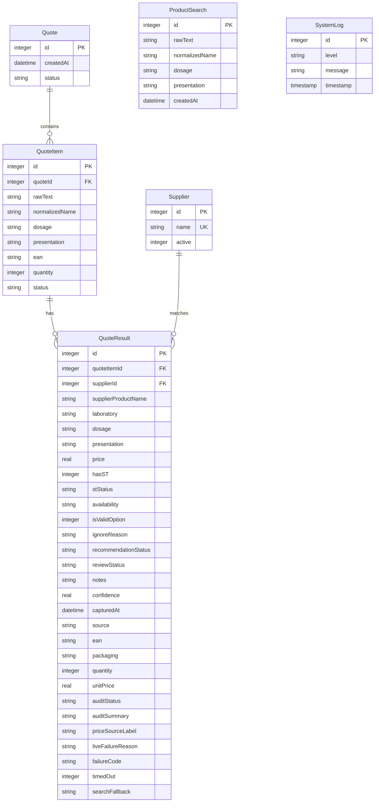

# Master System Guide - AI-Readable Documentation

This guide provides a comprehensive technical overview of the **Cotador Inteligente ST** system, detailing its architecture, database layers, algorithms, and frontend components. It is structured to help any AI agent quickly grasp the codebase, extend functionality, or deploy it onto different environments.

---

## 🏗️ System Architecture & Stack

The application is structured as a Desktop application powered by **Electron** on the backend and **React** (built with **Vite**) on the frontend. It is designed to work in two modes:
1.  **Local Desktop Mode:** Standalone deployment running offline, using local **SQLite** database storage.
2.  **Server Mode:** Web or networked server deployment using a remote **PostgreSQL** database.



---

## 🗄️ Database Layer (Dual-Driver Abstraction)

The system features a custom database adapter in [database.js](file:///c:/Users/Williany/Desktop/cotação/src/lib/database.js) which dynamically detects the `DB_TYPE` environment variable (`sqlite` or `postgres`).

### 1. Unified Interface Wrapper
All query execution calls utilize a unified wrapper (`dbWrapper`), enabling identical SQL execution syntax across the codebase:
- `db.exec(sql)` - For schema initialization.
- `db.run(sql, ...params)` - For inserts/updates. Returns `{ lastID }`.
- `db.get(sql, ...params)` - Fetches a single row.
- `db.all(sql, ...params)` - Fetches an array of rows.

### 2. Query Translator
When `DB_TYPE=postgres`, the database adapter automatically applies string translations to standard SQL queries:
- **Parameter Placeholders:** Translates positional `?` placeholders into indexed `$1, $2, $3` variables.
- **Ignore Conflict:** Converts SQLite-specific `INSERT OR IGNORE INTO` syntax into standard `INSERT INTO ... ON CONFLICT (name) DO NOTHING`.
- **Primary Keys:** Adapts auto-increment declarations (`INTEGER PRIMARY KEY AUTOINCREMENT` $\rightarrow$ `SERIAL PRIMARY KEY`).
- **Insert Returning:** Automatically appends `RETURNING id` to insert queries under PostgreSQL to capture `lastID` correctly.

### 3. Database Schema



---

## ⚙️ Core Engines & Algorithms

### 1. Normalization Parser (`parser.js`)
Extracts structured terms from unstructured text lines using regular expressions and dictionary matching:
- **EAN-13 Check Digit Verification:** Extracts 13-digit sequence candidates `/\b(\d{13})\b/` and validates them using EAN-13 check digit formula (summing odd positions and even positions $\times 3$, mod 10 subtraction). Invalid standalone candidates become `DESCRICAO_INSUFICIENTE` and never reach a supplier as a product name.
- **Dosage Extraction & Negative Lookahead:** Extracts dosage units (mg, mcg, g, ml, ui) with optional spaces and compact combinations such as `20/12,5mg`. Standardizes standalone dosage numbers (e.g. "50" -> "50mg"), but utilizes a negative lookahead `(?!\s*(?:capsulas|comp...))` to ignore pack counts (e.g. "30" in "losartana 30 cp") preventing them from polluting dosage attributes.
- **Presentation Matching:** Converts abbreviations (`comp`, `cp`, `caps`, `gts`) to standard forms (`comprimido`, `capsula`, `gotas`) using the `SYNONYMS` table.
- **Quantity Capture:** Extracts package size/count (e.g., "30 comp" $\rightarrow$ quantity `30`).
- **Confidence Rating:** Emits `ALTA` status if both dosage and presentation are verified; otherwise emits `PRODUTO_PARECIDO_REVISAR`.

#### Pharmaceutical Context (`pharmaceutical-context.js`)
- Expands controlled aliases and unique active-ingredient prefixes with a minimum of six characters before a live supplier search. Explicit established aliases such as `hctz` are supported separately.
- Canonicalizes `soro fisiologico` and `solucao fisiologica` as `cloreto de sodio`.
- Extracts known active ingredients and compares combinations as order-independent sets, so `hidrocloro olmesartana` matches `olmesartana + hidroclorotiazida` without relying on the plus sign.
- Keeps the single-ingredient safety gate: a supplier combination is blocked unless the query requests the complete association.
- Treats `xarope` and `suspensao oral` as equivalent while excluding ophthalmic, injectable, nasal, otologic, and other non-oral solutions.
- The same helpers are used by the parser, recommendation pre-check, and final quote auditor to prevent contradictory decisions.
- Reference brands are mapped to their active ingredient for matching without replacing the term sent to suppliers. For example, `clenil 250` remains a brand search while supplier rows containing beclometasona 250mcg are recognized.

#### Contextual Search Intelligence (`search-intelligence.js`)
- `analyzeQuoteBatch()` evaluates the complete list before any supplier is opened, preserving safe context from the preceding line.
- A unique short continuation can inherit its ingredient (`metformina 500` followed by `met 850`), while an ambiguous prefix is returned as `NEEDS_INFO` and is not sent to a portal.
- Known compact strengths are expanded into independent plans, so `sinvastatina 20 40` means 20 mg and 40 mg rather than quantity 40.
- Controlled spelling corrections and unique DCB prefixes are applied before the live search and persisted with original text, resolved text, reason, and confidence.
- `QueryCorrection` learns aliases only after a successful live result and only at high confidence or after repeated confirmation. It never stores or supplies price, stock, ST, or a recommendation.
- For input containing EAN plus description, the connector tries EAN first and retries by name only after a genuine empty response. Infrastructure errors stay blocked, and an exact barcode does not bypass a conflicting description supplied on the same line.

### 2. Substituição Tributária (ST) Rules Engine (`st-rules.js`)
Classifies tax conditions into four operational categories:

| Status | Tax Rule | Recommendation Behavior |
| :--- | :--- | :--- |
| **`COM_ST` / `ST_INCLUSO`** | ST included in invoice cost | **Approved (Priority 1):** Eligible for auto-recommendation |
| **`ST_SEPARADO`** | ST collected on a separate ticket | **Approved (Priority 2):** Flags warning for final cost validation |
| **`SEM_ST`** | No tax replacement | **Ignored:** Filtered out and hidden by default |
| **`ST_DESCONHECIDO`** | Unrecognized tax code | **Flagged:** Excludes recommendation, requires manual revision |

### 3. Recommendation & Ranking Engine (`recommendation.js`)
Ranks matching supplier results:
1. Filter out unavailable options (`availability !== 'disponível'`) and rejected reviews.
2. Reject `SEM_ST` before ranking. A product without ST must never be marked as `isValidOption` and must never receive `Melhor preço com ST`.
3. **Dosage and Unit Check:** Parses value + unit, converts equivalent mass units (`g`, `mg`, `mcg`) to a canonical amount and requires every requested strength in compact associations. Therefore `250mcg` never matches `250mg`, while `1000mcg` may match `1mg`. If the search contains name and dosage but omits presentation, matching supplier rows can still be recommended; the audit layer handles missing evidence as warnings instead of forcing every row into "produto parecido".
4. Run the Quote Auditor before ranking. Blocked rows are marked as `auditStatus='BLOQUEADO'`, removed from automatic recommendation, and sent to manual review. Warning rows keep `auditStatus='ATENCAO'` and remain visible with an explanation in `auditSummary`.
5. Group options that pass the valid ST test (`COM_ST`, `ST_INCLUSO`, `ST_SEPARADO`, or the explicit exemption `ST_ISENTO`) and pass the audit gate.
6. Sort by:
   - **Priority 1:** ST Priority (prefer `COM_ST` over `ST_SEPARADO`).
   - **Priority 2:** Lowest `unitPrice` when packaging differs.
7. Annotate the cheapest result as `Melhor preço com ST` and the runner-up as `Segunda opção com ST`.

`quote-summary.js` derives the consolidated result indicators after `getQuoteDetails()` reads the persisted rows. It counts priced sources conservatively, keeps timeout/failure evidence after reopening history, and calculates savings only between valid offers with the same ST priority, presentation, and package quantity. When no comparable alternative exists, savings is `null` and the UI displays `Não aplicável`.

### 4. Quote Auditor (`quote-auditor.js`)
Validates whether each supplier result is safe to use in the quotation:
- Blocks invalid or zero prices, unavailable products, `SEM_ST`, `ST_DESCONHECIDO`, EAN mismatch on barcode searches, dosage mismatch, presentation mismatch, and product names that do not fuzzy-match the search.
- Warns when non-critical evidence is missing, such as source/EAN, or when package quantity differs from the searched quantity.
- Detects price outliers across suppliers using comparable unit price (`unitPrice` when present, otherwise `price / quantity`) so different pack sizes do not create false alarms.
- Persists the outcome in `QuoteResult.auditStatus` and `QuoteResult.auditSummary`; the UI and XLSX export show these fields and route non-OK rows to review.

### 5. Real Supplier Extraction Rules
- **ANB:** searches with EAN when available; otherwise sends name + dosage + presentation. The captured quote price must come directly from the literal `Unit c/ST` grid column. Required headers are validated before extraction, the previous grid signature cannot satisfy a new search, and missing/zero `Unit c/ST` blocks the row. An exact EAN search can supply missing barcode evidence only when the portal returned one unambiguous row. Never fall back to `Preço`, `Preço + ST`, or a package calculation.
- **Profarma:** uses the Electron BrowserWindow scraper, normalizes old addresses to `https://pedido.profarma.com.br/`, opens `Novo Pedido`, and accepts only `Preço Final`. A medicine with `ST R$ -` is blocked unless its category is explicitly ST-exempt.
- **Santa Cruz:** uses `src/lib/santacruz-search.ps1` for the local JavaFX program. Discovery checks an optional environment override, a validated machine-local path cache, Desktop/Start Menu shortcuts, uninstall registry entries, standard install folders, and finally a time-bounded fixed-drive scan. It opens the app, handles login, waits for updates, enters Digitalizador/Novo Pedido, writes the medication, requires a changed live grid for every accepted price, extracts only column `Preço NF`, and requires green visual stock evidence from `Disp.`.
- **Santa Cruz preflight:** `--status-only` is read-only and reports `closed`, `ready`, `updating`, `login-required`, `logged-in-home`, `logged-in-orders`, `not-responding`, `running-without-window`, `open-not-ready`, or `not-installed`. The renderer polls this through `get-santacruz-status` every 30 seconds while Santa Cruz is selected.
- **Santa Cruz preparation:** `--prepare` reuses the same login/navigation path but stops after the live search grid is ready. Only this explicit operator command may restart a validated Santa Cruz `javaw` that has no accessible window; normal quotations remain fail-closed and never terminate the supplier application. An unrelated Java process never blocks startup. A `503 Service Unavailable` from the supplier updater remains a technical failure and must be retried later, never converted into an empty quote.
- **Santa Cruz repeated searches:** the robot reuses the open order screen, requests `Lista de Produtos [F3]` only when the grid is absent, verifies the exact typed value, and clears the input before returning. It first submits name + dosage through the magnifier. A confirmed empty `mg` or `mcg` grid triggers one same-session retry using only the active ingredient and `Enter`; the original dosage remains mandatory while the full virtual grid is scanned, so 100mg rows cannot satisfy a 50mg quote.
- **Santa Cruz column contract:** UI Automation must expose one unambiguous literal `Preço NF` header together with `Código EAN`, `Descrição`, `Disp.` and `ST`. Columns are resolved from `TablePattern` when available or by horizontally revealing the header band and matching each label to live cell bounds. Missing or duplicated required headers block every row.
- **Santa Cruz stock contract:** JavaFX exposes `Disp.` as an unnamed colored marker. The robot samples only the center of the current visible `Disp.` cell using its runtime bounds: green dominance means available, red means unavailable, and ambiguous/off-screen evidence remains blocked. Only non-off-screen grid rows count as observed, deduplication may replace unknown stock only with later visible evidence, and incomplete row coverage blocks the entire supplier result. If any presentation compatible with the requested dose still has unresolved `Disp.`, the supplier is blocked because that row could invalidate the claimed lowest available price.
- **Santa Cruz hang safety:** if the JavaFX process stops responding before or during a query, the connector returns a blocked `not-responding` result. No previous, partial, empty, or zero price is accepted. Timeout/abort starts a bounded best-effort cleanup of the search field and scroll position while leaving the supplier application open for operator recovery.
- **Santa Cruz portability contract:** runtime code must not contain a user profile, process ID, window handle, monitor resolution, absolute Windows framework path, fixed grid column, or copied installation cache. Assemblies, `LocalApplicationData`, the system drive, installation path, control bounds, DPI-sensitive offsets, headers, stock pixels and scroll increments are resolved on the current machine. The target PC must have an active, unlocked interactive Windows session.
- **DM Paraná:** opens only `https://portal.dmparana.com.br/login`, searches by medication name, scans all result pages, ignores cards without active purchase stock, and accepts only the literal card field `Preço final: R$`. The bold `R$ .../cada` amount is the raw price and must never be ranked. Each row carries `priceSourceLabel='Preço final: R$'` so the origin remains visible.
- **No stored-price fallback:** `santacruz-h2-reader.js` was removed. The recommendation engine also no longer caches unavailable searches. Historical SQLite rows are output/history only and are never inputs to `processQuoteQuery()`.
- **Freshness gate:** in real mode, every supplier row must have a valid `capturedAt` no older than five minutes. Missing or stale timestamps are blocked before ranking.
- **Fail-closed mode selection:** real operation requires `ENABLE_REAL_CONNECTORS=true`; test mocks require the separate explicit `ENABLE_MOCK_CONNECTORS=true`. When neither is enabled, quotation execution stops instead of silently selecting mocks. Browser UI mocks also require `VITE_ENABLE_UI_MOCKS=true`.

Operational notes added after the 2026-07-17 live tests:
- **ANB promotion gate:** if `#Promo` exists, select `ANB_COMMERCIAL_CONDITION` before typing the product. The condition is not reselected after submission, preventing a second grid refresh from replacing the requested result.
- **ANB popups:** close visible dialogs/overlays before search or extraction, because promotional banners can block the result grid and cause false timeouts.
- **Profarma active route:** use `https://pedido.profarma.com.br/` for ProfarmaOn. Old `portal.profarma.com.br` URLs should be normalized there. If login is rejected or the page stays on login, treat Profarma as unavailable instead of returning zero-price products.
- **Santa Cruz update state:** `SANTACRUZ_STARTUP_WAIT_SECONDS` controls normal startup, while `SANTACRUZ_UPDATE_WAIT_SECONDS` extends the first-run wait when the JavaFX updater is visible. If it still does not expose the live search field, return a blocked unavailable result; never read local product data.
- **Santa Cruz headless process:** if a matching `javaw` is active without a UI Automation window, the validated launcher is invoked once to recover/activate it. `SANTACRUZ_HEADLESS_GRACE_SECONDS` allows the slow Java/tax-rule startup; after the configured limit, return `running-without-window` as a blocked supplier state.
- **Santa Cruz supplier diagnostics:** when the current initializer log records a recent `503 Service Unavailable`, the readiness message exposes that supplier-side updater failure instead of reporting only a generic missing window.
- **Bounded quotation:** `CONNECTOR_TIMEOUT_MS` limits each web supplier (default 5 minutes), `SANTACRUZ_TIMEOUT_MS` limits the local GUI route (default 10 minutes), and `QUOTE_TIMEOUT_MS` stops the complete batch after 10 minutes. Pending BrowserWindows and PowerShell automation receive a real abort signal; completed live rows remain saved and timed-out sources return a blocked result.
- **Scraper timeout:** `SCRAPER_TIMEOUT_MS` remains the inner BrowserWindow safety guard and must not exceed the operational connector budget without a documented reason.
- **Network retry:** only `retryable` transient portal failures are attempted once more (`CONNECTOR_RETRY_COUNT=1`). Configuration failures and local GUI failures are not retried.
- **Diagnostic circuit breaker:** `npm run diagnose:live` stops repeating terms for a supplier after an infrastructure failure and records the same blocked reason for the remaining checks.
- **Live diagnostic shutdown:** `npm run diagnose:live` writes a sanitized JSON report, closes SQLite, and requests Electron shutdown without terminating native handles abruptly.
- **Diagnostic lifecycle:** closing an individual hidden scraper window does not trigger Electron shutdown while `--live-diagnostic` is still running; this allows the Santa Cruz child process and later suppliers to finish.
- **DM search contract:** use only the normalized medication name in the portal input. Dosage, presentation, package quantity, EAN, ST and combination checks remain in the auditor; sending the full parsed phrase can produce a false empty search on this portal.
- **DM stale-catalog gate:** the live grid must contain a direct non-combination match for a single-ingredient query. If the portal keeps the general catalog, the scraper clears and submits once more, then fails closed instead of accepting unrelated cards.
- **DM pagination and stock:** traverse `Go to next page` while enabled, deduplicate by EAN, require an enabled `Comprar` button, and stop after ten pages as a defensive limit.
- **DM final-price proof:** results without the exact `Preço final: R$` label are discarded instead of falling back to the bold raw amount.

### 6. Credentials Storage and Portability (`database.js`)
- The settings view exposes URL/program path, login, password, and optional client code for all four suppliers.
- `CREDENTIAL_STORAGE_MODE=plain` stores a `plain:` Base64 payload in local SQLite. This is portable but not encrypted and is the intended mode for this internal installation.
- `CREDENTIAL_STORAGE_MODE=dpapi` remains available for machine-bound Windows protection through Electron `safeStorage`.
- Credential rows are resolved and reconciled by canonical supplier name. ANB/Profarma/Santa Cruz/DM can use canonical UI IDs `1..4` even when SQLite assigned another internal ID (observed with DM ID `286`).
- `.env`, SQLite databases, logs, screenshots, and supplier credentials must remain outside Git in both modes.

---

## 🎨 UI Architecture & Frontend Flow

The React frontend is an operational workspace with a dark navigation rail and a neutral, high-contrast content surface:
- **Window lifecycle:** Electron creates the window hidden, maximizes it on `ready-to-show`, then displays it with minimum operational dimensions to avoid startup resizing and clipped controls.
- **View state:** switches among medication search, consolidated results, and supplier credential settings without changing the Electron IPC contracts.
- **Search workspace:** displays item and supplier counts, one-query-per-line input, quick examples, and explicit supplier selection before starting a live quote.
- **Input interpretation:** a preview shows inherited context, spelling corrections and expanded strengths. `NEEDS_INFO` rows stay red and remain visible even under the normal ST filters.
- **History:** the full local history is collapsed by default and searchable through medication terms aggregated from `QuoteItem`.
- **Result traceability:** the recommendation cards and detail table show the exact accepted field for each supplier: ANB `Unit c/ST`, Santa Cruz `Preço NF`, Profarma `Preço Final`, and DM Paraná `Preço final: R$`.
- **Decision hierarchy:** the consolidated gradient header states coverage and quote health; one recommendation card is rendered per medication with its best valid offer and optional second choice. Comparison tools are secondary and collapsed by default.
- **Responsive result modes:** desktop uses a dense comparison table, 901-1280 px uses a compact labeled-card table, and screens up to 900 px use a single-column operational layout without horizontal overflow.
- **Live progress contract:** `main.js` emits sanitized `quote-progress` events for quote, item and supplier phases; `preload.js` exposes a removable listener; `quote-progress.js` reduces those events into deterministic UI state and percentage. Supplier rows must reflect real connector completion, failure, retry, empty response, block or timeout rather than estimated timers.
- **Responsive table:** below 900 px, every result row becomes a labeled card while preserving EAN, package, distributor, final price source, ST, stock, audit, recommendation, and review action.
- **Status semantics:** green is reserved for valid ST/recommendations, red for blocked without ST, amber for review, and blue for informational/secondary states.
- **Icons:** interface commands use `lucide-react`; buttons retain accessible text or labels and visible keyboard focus.
- **Manual review:** opening `Revisar` keeps the existing edit and recalculation flow through `recalculateQuoteItemRecommendations`.


```bash
# Environment Mode
APP_ENV=development
LOG_LEVEL=info

# Scrapers Toggles
ENABLE_MOCK_CONNECTORS=false
ENABLE_REAL_CONNECTORS=true
SHOW_SCRAPER_WINDOW=false
ANB_COMMERCIAL_CONDITION=PREMIUM TOP 7 DIAS
SCRAPER_TIMEOUT_MS=300000
CONNECTOR_TIMEOUT_MS=300000
SANTACRUZ_TIMEOUT_MS=600000
QUOTE_TIMEOUT_MS=600000
CONNECTOR_RETRY_COUNT=1
CONNECTOR_RETRY_DELAY_MS=1000
SANTACRUZ_STARTUP_WAIT_SECONDS=180
SANTACRUZ_UPDATE_WAIT_SECONDS=300
SANTACRUZ_HEADLESS_GRACE_SECONDS=240
SANTACRUZ_RESTORE_FOCUS=true

# Database Switch (sqlite or postgres)
DB_TYPE=sqlite
DATABASE_PATH=local
CREDENTIAL_STORAGE_MODE=plain

# If postgres is chosen, specify credentials:
PG_HOST=localhost
PG_PORT=5432
PG_USER=postgres
PG_PASSWORD=yourpassword
PG_DATABASE=cotador_st
```

`ENABLE_REAL_CONNECTORS=false` is a deterministic mock mode and must be treated as business-rule testing only. It returns catalog fixtures instantly and does not represent live supplier pricing. For pharmacy price quotation, use `ENABLE_REAL_CONNECTORS=true` with saved supplier credentials. When `DATABASE_PATH=local`, SQLite is opened from `data/cotador-st.db`; this is the portable database used for local credentials and quote history.

### Running Commands
- **Daily Windows launcher:** `wimi cotacao.bat` delegates to `wimi cotacao.vbs`, which starts `cotacao.bat` with window style `0` and redirects output to `logs/startup.log`.
- **Prepare and Start:** `npm run dev` (Git seguro, dependências e aplicativo)
- **Preparation Only:** `node scripts/bootstrap.mjs --prepare-only`
- **Startup Diagnostics:** `node scripts/bootstrap.mjs --diagnose`
- **Live Supplier Audit:** `npm run diagnose:live -- "losartana 50mg"`
- **Unit Testing:** `npm run test`
- **Windows Packaging:** `npm run build` followed by `npm run package`

### Startup Bootstrap and Updates
- `cotação.bat`, `start-app.bat` e `wimi cotacao.bat` convergem para o launcher oculto; `cotacao.bat` permanece como entrada técnica e todos executam o mesmo bootstrap Node.
- Antes do Electron, o bootstrap consulta o estado Git. Uma atualização só é aceita com worktree limpa, upstream conhecido ou branch idêntica ao padrão de `origin`, `git fetch` bem-sucedido e `git merge --ff-only`.
- Alterações locais em arquivos rastreados, ausência de referência remota segura, falta de Git ou indisponibilidade de rede não apagam arquivos nem bloqueiam a versão instalada; nesses casos a atualização de código é ignorada. Arquivos locais não rastreados são preservados e qualquer conflito faz o `merge --ff-only` abortar.
- `npm install --no-audit --no-fund` reconcilia as dependências declaradas antes de iniciar `dev:app`.
- `package.json#allowScripts` aprova somente as versões fixadas de `sqlite3` e `electron-winstaller`, evitando bloqueio futuro do npm em uma instalação nova sem liberar scripts de dependências indiscriminadamente.
- Cada inicialização grava um estado sanitizado em `logs/update-status.json`. A interface torna visíveis atualização aplicada, falta de conexão, pasta sem `.git`, branch sem upstream, atualização desativada ou bloqueio por alterações locais.
- O Electron consulta o upstream com `execFile` oculto na abertura e a cada `AUTO_UPDATE_CHECK_INTERVAL_MS` (15 minutos por padrão). A interface avisa sobre commits detectados; a instalação acontece na próxima abertura, fora do processo Electron, evitando atualizar arquivos em uso.
- `AUTO_UPDATE_ON_STARTUP=false` desativa a etapa Git. `AUTO_UPDATE_BRANCH` é opcional e só pode completar o upstream da mesma branch que já está ativa; o bootstrap nunca troca de branch automaticamente.
- Para outro computador, usar `git clone` ou copiar também a pasta oculta `.git`. Um ZIP sem metadados Git é deliberadamente marcado como incapaz de se atualizar, embora a versão local continue utilizável.
- O launcher VBS valida Node.js antes de iniciar o processo oculto e mostra uma caixa de erro quando o requisito não existe. Git ausente é um estado separado de `.git` ausente para orientar corretamente a preparação do computador.

### Test Coverage Focus
The Node test suite validates the high-risk pharmacy purchase paths:
- Parser extraction for EAN, dosage, quantity, presentation, fuzzy names, and vague-query refinement.
- Pharmaceutical context for safe abbreviations, order-independent associations, oral-liquid equivalence, physiological-solution aliases, and unsafe-short-prefix rejection.
- ST safety rules, including the guarantee that `SEM_ST` cannot become a best recommendation.
- Numerical dosage mismatch protection to avoid purchasing the wrong strength.
- Structured unavailable rows when suppliers return no matches.
- SQLite quote persistence plus manual review recalculation.
- XLSX export workbook structure and best/ignored sheet routing.
- Startup update safety for disabled updates, dirty worktrees, missing upstreams, and clean tracked repositories.
- Current validation: `npm test` 115/115, `npm run build` approved, `npm run lint` without blocking errors, plus live `clenil 250` checks on all four suppliers.

### Delivery Workflow
- Every completed project change includes synchronized documentation, executable validation, a scoped Git commit, and a push of the current branch by default.
- The staged diff must be reviewed before commit. Credentials, `.env`, databases, logs, caches, screenshots, and supplier-owned binaries stay local.
- A blocked push does not justify rewriting history or discarding work. Keep the local commit and report the exact authentication, network, or remote rejection.
