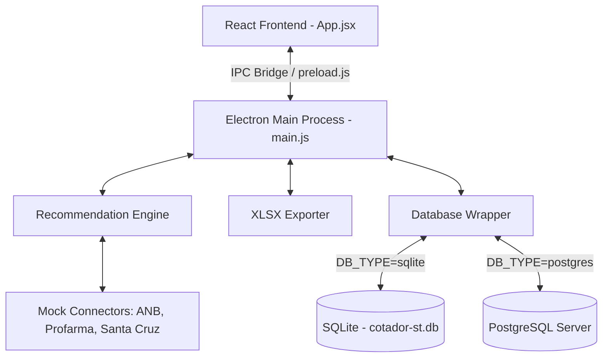
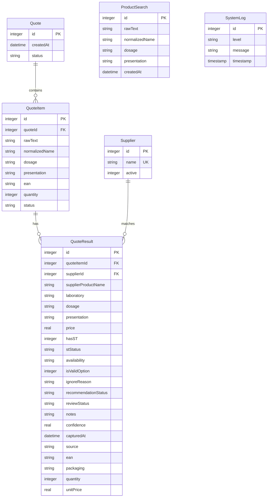

# Master System Guide - AI-Readable Documentation

This guide provides a comprehensive technical overview of the **Cotador Inteligente ST** system, detailing its architecture, database layers, algorithms, and frontend components. It is structured to help any AI agent quickly grasp the codebase, extend functionality, or deploy it onto different environments.

---

## 🏗️ System Architecture & Stack

The application is structured as a Desktop application powered by **Electron** on the backend and **React** (built with **Vite**) on the frontend. It is designed to work in two modes:
1.  **Local Desktop Mode:** Standalone deployment running offline, using local **SQLite** database storage.
2.  **Server Mode:** Web or networked server deployment using a remote **PostgreSQL** database.



---

## 🗄️ Database Layer (Dual-Driver Abstraction)

The system features a custom database adapter in [database.js](file:///c:/Users/Williany/Desktop/cotação/src/lib/database.js) which dynamically detects the `DB_TYPE` environment variable (`sqlite` or `postgres`).

### 1. Unified Interface Wrapper
All query execution calls utilize a unified wrapper (`dbWrapper`), enabling identical SQL execution syntax across the codebase:
- `db.exec(sql)` - For schema initialization.
- `db.run(sql, ...params)` - For inserts/updates. Returns `{ lastID }`.
- `db.get(sql, ...params)` - Fetches a single row.
- `db.all(sql, ...params)` - Fetches an array of rows.

### 2. Query Translator
When `DB_TYPE=postgres`, the database adapter automatically applies string translations to standard SQL queries:
- **Parameter Placeholders:** Translates positional `?` placeholders into indexed `$1, $2, $3` variables.
- **Ignore Conflict:** Converts SQLite-specific `INSERT OR IGNORE INTO` syntax into standard `INSERT INTO ... ON CONFLICT (name) DO NOTHING`.
- **Primary Keys:** Adapts auto-increment declarations (`INTEGER PRIMARY KEY AUTOINCREMENT` $\rightarrow$ `SERIAL PRIMARY KEY`).
- **Insert Returning:** Automatically appends `RETURNING id` to insert queries under PostgreSQL to capture `lastID` correctly.

### 3. Database Schema



---

## ⚙️ Core Engines & Algorithms

### 1. Normalization Parser (`parser.js`)
Extracts structured terms from unstructured text lines using regular expressions and dictionary matching:
- **EAN Matching:** Checks for 13-digit sequence patterns `/\b(\d{13})\b/`.
- **Dosage Extraction:** Extracts dosage units (mg, mcg, g, ml, ui) using:
  `/(\d+(?:[.,]\d+)?\s*(?:mg|mcg|g|ml|ui))\b/i`.
- **Presentation Matching:** Converts abbreviations (`comp`, `cp`, `caps`, `gts`) to standard forms (`comprimido`, `capsula`, `gotas`) using the `SYNONYMS` table.
- **Quantity Capture:** Extracts package size/count (e.g., "30 comp" $\rightarrow$ quantity `30`).
- **Confidence Rating:** Emits `ALTA` status if both dosage and presentation are verified; otherwise emits `PRODUTO_PARECIDO_REVISAR`.

### 2. Substituição Tributária (ST) Rules Engine (`st-rules.js`)
Classifies tax conditions into four operational categories:

| Status | Tax Rule | Recommendation Behavior |
| :--- | :--- | :--- |
| **`COM_ST` / `ST_INCLUSO`** | ST included in invoice cost | **Approved (Priority 1):** Eligible for auto-recommendation |
| **`ST_SEPARADO`** | ST collected on a separate ticket | **Approved (Priority 2):** Flags warning for final cost validation |
| **`SEM_ST`** | No tax replacement | **Ignored:** Filtered out and hidden by default |
| **`ST_DESCONHECIDO`** | Unrecognized tax code | **Flagged:** Excludes recommendation, requires manual revision |

### 3. Recommendation & Ranking Engine (`recommendation.js`)
Ranks matching supplier results by analyzing **unit cost efficiency**:
1. Filter out unavailable options (`availability !== 'disponível'`) and rejected reviews.
2. Group options that pass the valid ST test.
3. Compute the unit price:
   $$\text{unitPrice} = \frac{\text{price}}{\text{quantity}}$$
4. Sort by:
   - **Priority 1:** ST Priority (prefer `COM_ST` over `ST_SEPARADO`).
   - **Priority 2:** Lowest `unitPrice`.
5. Annotate the cheapest result as `Melhor preço com ST` and the runner-up as `Segunda opção com ST`.

---

## 🎨 UI Architecture & Frontend Flow

The React frontend utilizes a modern dark interface with glassmorphic cards and dynamic transitions:
- **`currentView` State Switcher:** Routes between three core views:
  1. `'search'`: Textarea box to enter raw product queries.
  2. `'results'`: Visual dashboard showing structured comparison tables and metrics.
  3. `'logs'`: Diagnositc table displaying the database logs.
- **"Melhor Condição Geral" Card:** Loops through all results to locate the absolute cost-efficient winner:
  - Selects the option with the lowest `unitPrice` across all queries.
  - Highlights EAN, packaging unit, total cost, cost per unit, and estimated savings.
- **Manual Review Interactivity:** Clicking **✏️ Revisar** opens a modal to edit EAN, pricing, ST classification, availability, and notes. Saving triggers a call to `recalculateQuoteItemRecommendations` to re-run the ranking system.

---

## 🛡️ Logging, Audit & Self-Diagnostics

### 1. Dual Logger System
The `logger.js` component operates on a dual-logging system:
- **Database Table:** Inserts logs into `SystemLog` table for live visualization in the web panel.
- **Local File:** Appends logs to `logs/app.log`.

### 2. Log Rotation
To protect server space, the physical `logs/app.log` file is protected by a **2MB limit**. When the file surpasses 2MB, the system automatically truncates it, preserving only the last 500 lines.

---

## 🚀 Environment Setup & Deployment

Configure your project using variables in your `.env` file:

```bash
# Environment Mode
APP_ENV=development
LOG_LEVEL=info

# Scrapers Toggles
ENABLE_MOCK_CONNECTORS=true
ENABLE_REAL_CONNECTORS=false

# Database Switch (sqlite or postgres)
DB_TYPE=sqlite

# If postgres is chosen, specify credentials:
PG_HOST=localhost
PG_PORT=5432
PG_USER=postgres
PG_PASSWORD=yourpassword
PG_DATABASE=cotador_st
```

### Running Commands
- **Install Dependencies:** `npm install`
- **Development Server:** `npm run dev`
- **Unit Testing:** `npm run test`
- **Windows Packaging:** `npm run build` followed by `npm run package`
